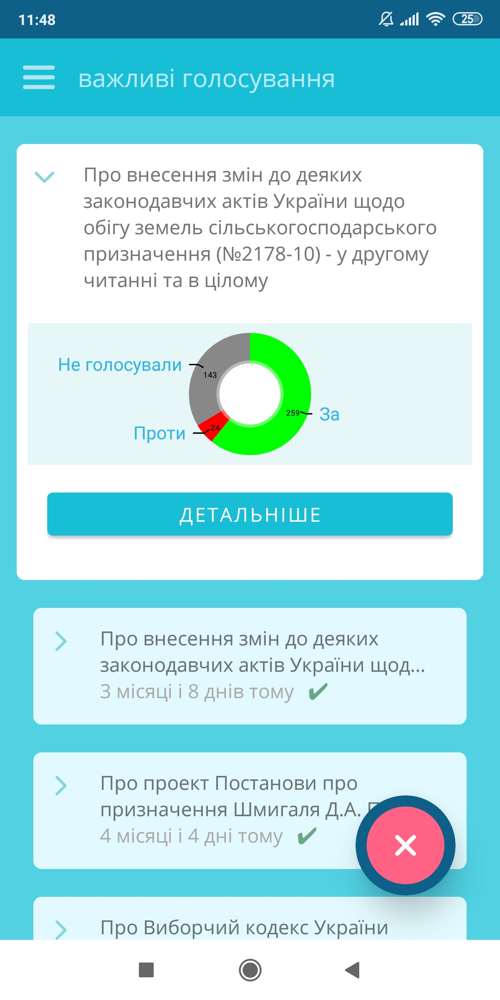
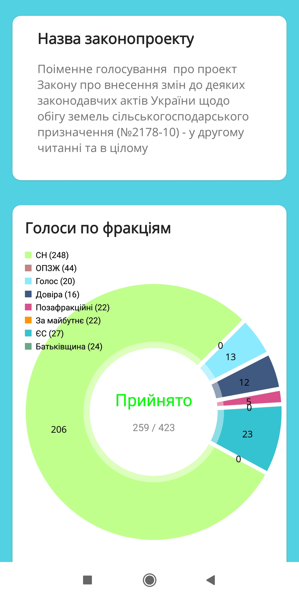
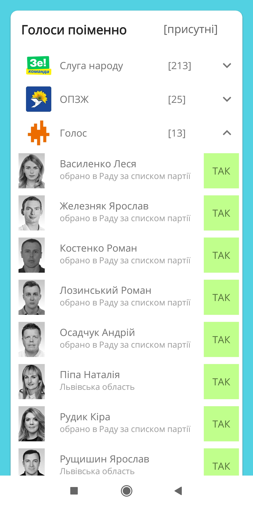

# Закони UA
An Android app about how Ukrainian political parties votes.  
(The app do not represent any government entity, all data are from https://rada4you.org)

## Screenshots

  

## Technologies
- Kotlin
- Retrofit
- MVVM
## Credits
- https://github.com/nikhilpanju/FabFilter
- https://rada4you.org
